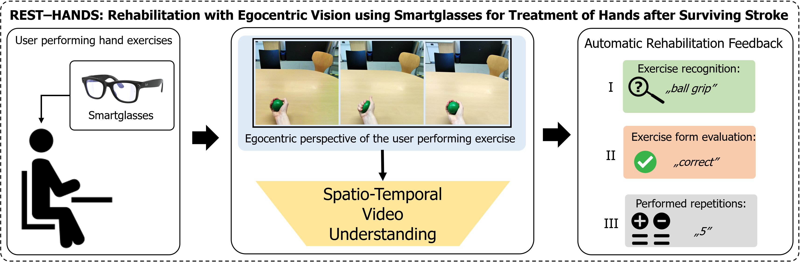
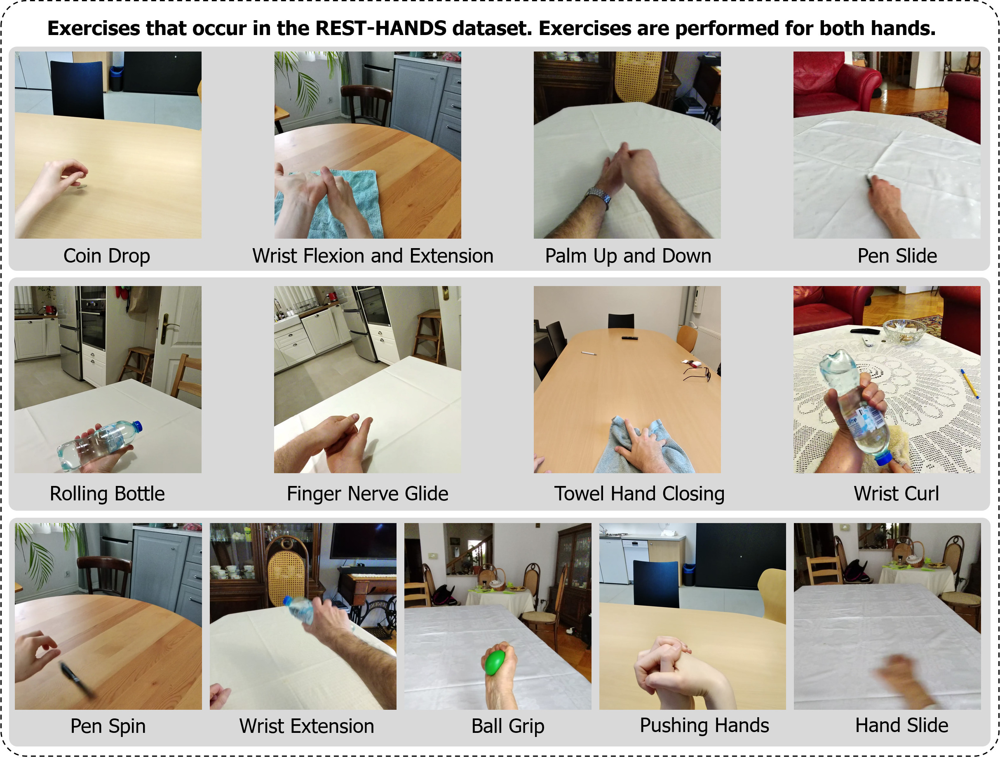

# REST-HANDS: Rehabilitation with Egocentric Vision Using Smartglasses for Treatment of Hands after Surviving Stroke




<a href="https://arxiv.org/abs/2409.20116" target="_blank">
    
</a>

**Authors:** Wiktor Mucha, Kentaro Tanaka, Martin Kampel  


---

## Overview

**REST-HANDS** is a research project that explores the use of smart glasses to support hand rehabilitation for people recovering from strokes. By using video from RayBan Stories smart glasses, the project aims to help stroke survivors regain hand function through remote therapy. This repository provides the dataset, evaluation scripts, and benchmarks referenced in the study.

Stroke is one of the leading causes of death and disability worldwide. For survivors, lasting hand difficulties can significantly impact their daily lives and well-being. Conventional rehabilitation often relies on consistent medical support, which can be challenging to access due to limited healthcare resources.

### Abstract

In this study, we examine whether smart glasses can be used to assist in hand rehabilitation remotely. Using video captured from RayBan Stories smart glasses, our research focuses on recognizing exercises, assessing form, and counting repetitions in hand therapy. We created the **REST-HANDS** dataset, the first collection of egocentric videos for hand exercises, to support this work. Key results include:

- **Exercise Recognition**: Achieved 98.55% accuracy
- **Form Evaluation**: Achieved 86.98% accuracy
- **Repetition Counting**: Mean absolute error of 1.33

These findings suggest that smart glasses may effectively support remote rehabilitation, opening up new possibilities for future research.


---

## Contents

- [Dataset](#dataset)
- [Usage](#usage)
- [License](#license)
- [Citation](#citation)

---

## Dataset



The **REST-HANDS** dataset consists of egocentric videos of hand exercises captured from RayBan Stories smart glasses. The dataset is designed for research purposes and includes samples with labeled exercises, evaluation metrics, and repetition counts.

The dataset is available for research purposes. For inquiries, please contact us at **wiktor.mucha@tuwien.ac.at**.


### Dataset Structure

The dataset is organized as follows:

```
Dataset/
     labels/
          train.csv
          val.csv
          ...
     Subject_1/
          1_coin_left
               000001.jpg
               000002.jpg
               ...
          2_coin_right
          ...
          25_side_to_side
     Subject_2/
     ...
     Subject_9/
```

## Usage

The code provided in this repository includes the following:

- **DataLoader**: The dataset is loaded using a custom DataLoader, which is controlled by a Spock dataclasses configuration file in `.yaml` format. This configuration allows for easy customization and flexibility in handling the data.

- **Training Code**: The repository also includes scripts for training models on the provided dataset. The training code is ready to use and can be easily adapted to your specific research needs.


## License

### Research-Only License Agreement

This dataset and associated code (collectively, "Materials") are made available under a research-only license. By accessing, downloading, or using the Materials, you agree to the following terms:

1. **Permitted Use**:  
   You may use the Materials solely for non-commercial research and academic purposes. This includes activities such as analyzing data, conducting experiments, and publishing research results, provided that these activities are strictly for academic or research purposes and do not involve commercial use, distribution, or profit.

2. **Restrictions**:
   - **No Commercial Use**: You may not use the Materials for any commercial purpose, including but not limited to commercial research, product development, or as part of any service offering.
   - **No Redistribution**: You may not redistribute, sublicense, or transfer the Materials, either in part or in whole, to any third party without prior written permission from the authors.
   - **Modification and Derivative Works**: You may create derivative works for your research purposes; however, these derivative works must remain subject to this license and may not be distributed outside of your research group.


## Citation

If you use the REST-HANDS dataset or code in your research, please consider to cite our paper:

```bibtex
@inproceedings{mucha2025rest,
  title={REST-HANDS: Rehabilitation with Egocentric Vision Using Smartglasses for Treatment of Hands After Surviving Stroke},
  author={Mucha, Wiktor and Tanaka, Kentaro and Kampel, Martin},
  booktitle={European Conference on Computer Vision},
  pages={253--270},
  year={2025},
  organization={Springer}
}
